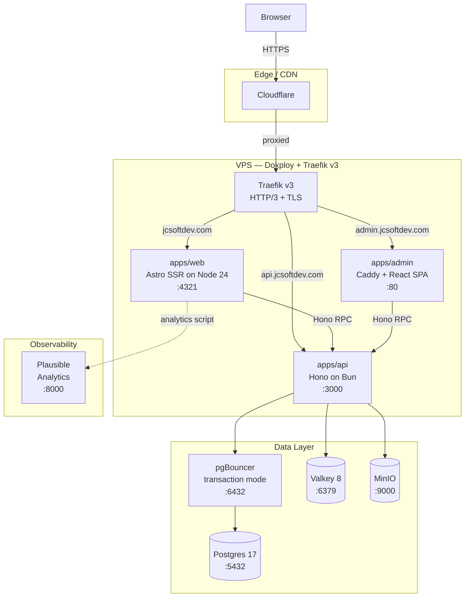

# jcsoftdev

Personal portfolio platform showcasing full-stack engineering with a modern 2026 stack.

## Stack

| Layer | Technology | Version |
|---|---|---|
| **Runtime (server)** | Node.js | 24 LTS |
| **Runtime (api/scripts)** | Bun | 1.4 |
| **Package manager** | pnpm | 10 |
| **Monorepo** | Turborepo | 2 |
| **Web framework** | Astro | 5 |
| **API framework** | Hono | 4.7+ |
| **UI** | React | 19 |
| **Bundler (admin)** | Vite | 7 (Rolldown-native) |
| **Styling** | Tailwind CSS | v4 (CSS-first) |
| **Router (admin)** | TanStack Router | 1 |
| **ORM** | Drizzle ORM | latest |
| **Validation** | Zod | 4 |
| **Linter/Formatter** | Biome | 2 |
| **Testing** | Vitest | 3 |
| **Animations** | GSAP + Lenis | 3.13+ / 1.x |
| **Database** | Postgres | 17 |
| **Connection pool** | pgBouncer | latest |
| **Cache/Queue** | Valkey | 8 (Redis OSS fork) |
| **Object storage** | MinIO | latest |
| **Analytics** | Plausible | community-edition |
| **Auth** | better-auth | latest (change: core-platform) |
| **Email** | Resend | latest (change: core-platform) |
| **Deployment** | Dokploy | latest |
| **Reverse proxy** | Traefik | v3 |
| **CDN/Edge** | Cloudflare | — |

## Monorepo Structure

```
jcsoftdev/
├── apps/
│   ├── api/       — Hono REST + RPC API, runs on Bun 1.4
│   ├── web/       — Astro 5 public site + blog (SSR, Server Islands)
│   └── admin/     — React 19 + Vite 7 SPA for content management
├── packages/
│   ├── config/    — Shared tsconfig, Biome config, Tailwind preset
│   ├── db/        — Drizzle schema, migrations, pgBouncer-safe client
│   ├── types/     — Shared TypeScript types + Hono AppType re-export
│   ├── ui/        — Shared React components (web + admin)
│   └── animations/ — GSAP timelines + Lenis scroll factory (SSR-safe)
├── docs/
│   ├── architecture.md
│   └── dokploy.md
├── docker-compose.yml  — Local dev services (Postgres, Valkey, MinIO, Plausible)
└── .github/workflows/ci.yml
```

## Architecture



## Quickstart

### Prerequisites

- [mise](https://mise.jdx.dev/) — installs all runtimes automatically from `.mise.toml`
- [Docker](https://www.docker.com/) — for local infrastructure services

### Setup

```bash
# 1. Install runtimes (Node 24, Bun 1.4, pnpm 10)
mise install

# 2. Install workspace dependencies
pnpm install

# 3. Copy env file and configure
cp .env.example .env
# Edit .env with your values (defaults work for local dev)

# 4. Copy per-app env files (public API URL config)
cp apps/web/.env.example apps/web/.env
cp apps/admin/.env.example apps/admin/.env
# defaults (PUBLIC_API_URL / VITE_API_URL = http://localhost:8787) work for local dev

# 5. Start infrastructure services (Postgres, Valkey, MinIO)
pnpm dev:services

# 6. Run database migrations (first time or after schema changes)
pnpm --filter @jcsoftdev/db db:migrate

# 7. Bootstrap MinIO bucket (first time only)
bash infra/minio/bootstrap.sh

# 8. Seed sample data — projects and experiences (idempotent, safe to re-run)
pnpm --filter @jcsoftdev/db seed
# For a fresh DB (truncate + re-seed), use:
# pnpm --filter @jcsoftdev/db seed:reset --confirm

# 9. Start all apps
pnpm dev:apps
```

Or to start everything at once (skips step 6–8 on subsequent runs if already done):

```bash
pnpm dev
```

Services started by `pnpm dev`:
- `http://localhost:8787` — API (Hono) — default `PUBLIC_API_URL` / `VITE_API_URL`
- `http://localhost:4321` — Web (Astro)
- `http://localhost:5173` — Admin (Vite)
- `http://localhost:9001` — MinIO console
- `http://localhost:8000` — Plausible analytics

> **Port note**: `PUBLIC_API_URL` (web) and `VITE_API_URL` (admin) must both point to the API port.
> The default `http://localhost:8787` matches the API's `PORT` in the root `.env`.
> If you change the API port, update both per-app `.env` files accordingly.

### Seed commands

```bash
# Idempotent seed — inserts rows, skips existing (safe to re-run any time)
pnpm --filter @jcsoftdev/db seed

# Reset seed — TRUNCATES projects + experiences, then re-seeds from scratch
# Requires --confirm flag; refuses to run when NODE_ENV=production
pnpm --filter @jcsoftdev/db seed:reset --confirm
```

### Other commands

```bash
pnpm dev:stop        # Stop docker services
pnpm build           # Build all apps
pnpm typecheck       # tsc across all packages
pnpm test            # Vitest across all packages
pnpm lint            # Biome check
pnpm format:astro    # Prettier on .astro files
```

## Documentation

- [Architecture decisions and diagrams](./docs/architecture.md)
- [Dokploy deployment guide](./docs/dokploy.md)

## License

MIT
