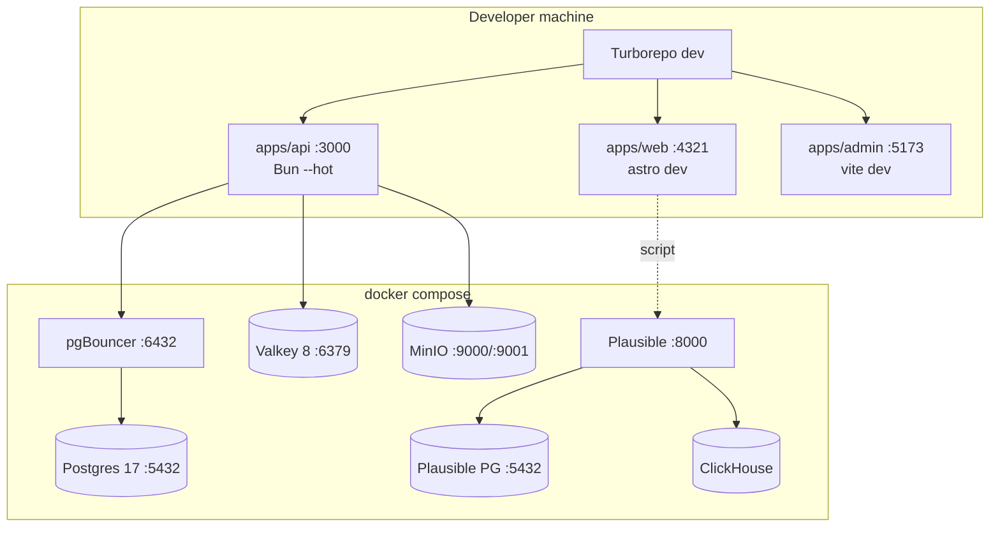
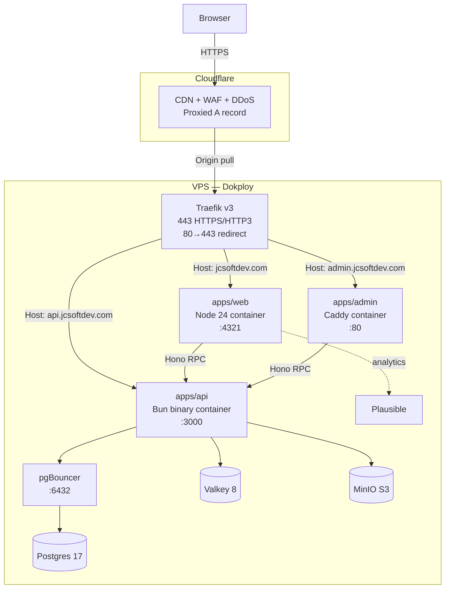

# Architecture — jcsoftdev

## Overview

jcsoftdev is a personal portfolio platform with three deployable apps sharing typed infrastructure. The design prioritizes type-safety end-to-end (Hono RPC → React clients), zero runtime surprises in production (pgBouncer constraints encoded at the library level), and a clear separation between edge caching (Cloudflare) and origin logic (Hono/Astro).

---

## Architecture Decision Records (ADRs)

### ADR-1: pnpm workspace + Bun runtime (not Bun workspaces)

**Decision**: Use pnpm 10 as the package manager with `pnpm-workspace.yaml`, but run `apps/api` with the Bun runtime.

**Rationale**:
- Bun workspaces lack mature Turborepo integration. pnpm has first-class Turborepo support with task caching.
- pnpm strict peer dependency resolution catches version mismatches at install time, not at runtime.
- Bun's runtime is the fastest Node-compatible server runtime available. `Bun.serve` is used for the API binary. `bun build --compile --minify` produces a self-contained binary for deployment.
- Web and admin apps use Node 24 (Astro's `@astrojs/node` adapter, Vite 7) — both fully support Node 24 LTS and benefit from V8 improvements over Bun for SSR.

**Consequence**: Two runtimes coexist. `.mise.toml` pins both. Dockerfiles use different base images per app.

---

### ADR-2: Valkey 8 replaces Redis

**Decision**: Use `valkey/valkey:8-alpine` everywhere Redis would appear.

**Rationale**: Redis changed its license to RSALv2/SSPL in 2024. Valkey is the Linux Foundation OSS fork (backed by AWS, Google, Oracle, Ericsson, Snap), released under BSD-3. It is a drop-in wire-compatible replacement — any ioredis/redis client works unchanged. Valkey 8 is actively developed and ahead of Redis 7 in some performance metrics.

**Consequence**: `docker-compose.yml` uses the Valkey image. Env var is `VALKEY_URL` (not `REDIS_URL`) for clarity, but the protocol is still `redis://`.

---

### ADR-3: pgBouncer in transaction mode (mandatory)

**Decision**: All application code connects through pgBouncer on port 6432. Direct Postgres (port 5432) is reserved exclusively for migrations.

**Rationale**: VPS deployments face connection count limits. pgBouncer transaction mode allows hundreds of app connections to share a small pool of real Postgres connections.

**Constraints imposed by transaction mode**:
- `prepare: false` in postgres-js — prepared statements require session state; transaction mode drops them between transactions.
- No advisory locks (`pg_advisory_lock`) — they are session-scoped.
- No `SET` commands that persist across transactions (e.g., `SET search_path`).
- No `LISTEN/NOTIFY` through pgBouncer — requires a direct connection.
- Drizzle migrations use `DATABASE_DIRECT_URL` to bypass pgBouncer.

**Where this is encoded**: `packages/db/src/client.ts` passes `{ prepare: false }` to postgres-js. `packages/db/README.md` documents all constraints.

---

### ADR-4: Zod 4 per-package (no global override)

**Decision**: Each package/app declares `zod: "^4.x"` in its own `dependencies`. No global pnpm override for Zod.

**Rationale**: Astro 5 internally requires Zod ^3.x. Adding a global `pnpm.overrides.zod: "^4"` breaks Astro's internal validation. Since Zod 4 is a peer dep for most validation consumers (not a runtime singleton like React), per-package declaration is safe.

**Consequence**: `pnpm why zod` will show two versions (3.x via astro, 4.x via our code). This is intentional and documented. The drizzle-orm dedup gate in CI only checks drizzle-orm — Zod is exempt.

---

### ADR-5: Hono RPC type-sharing via packages/types

**Decision**: `apps/api` exports `AppType = typeof app`. `packages/types` re-exports it as a type-only barrel. Both `apps/web` and `apps/admin` import `AppType` from `@jcsoftdev/types`.

**Rationale**: Direct cross-app workspace imports (`apps/web` importing from `apps/api`) create implicit build-order dependencies that Turborepo can't model cleanly. Routing through a shared package (`packages/types`) makes the dependency explicit, pnpm-resolvable, and visible in `turbo.json`'s task graph.

**Consequence**: `@jcsoftdev/api` is a `devDependency` of `@jcsoftdev/types` — only its types are consumed, never its runtime code. `tsc --noEmit` verifies the chain.

---

## Topology Diagrams

### Local Development (docker compose)



### Production (Dokploy on VPS)



---

## Cloudflare → Traefik → Service Routing

1. All subdomains (`jcsoftdev.com`, `api.jcsoftdev.com`, `admin.jcsoftdev.com`) are Cloudflare-proxied A records pointing to the VPS IP.
2. Cloudflare terminates TLS for the browser. The CF→VPS connection uses Cloudflare Origin Certificates (15-year, free) — Traefik trusts the CF CA.
3. Traefik v3 matches `Host` header via Docker labels on each container. Each app sets its own label:
   ```yaml
   labels:
     - "traefik.http.routers.web.rule=Host(`jcsoftdev.com`)"
     - "traefik.http.routers.web.tls=true"
   ```
4. Compression is handled at Cloudflare for requests that pass through the edge (`CF-Connecting-IP` header is present). The Hono compression middleware skips compression when this header is set (see `apps/api/src/app.ts`).

---

## Server Islands Decision Tree

Astro 5 Server Islands (`client:*` directives on React components) allow selective hydration. Use this decision tree:

```
Is the component purely presentational (no state, no events)?
  YES → Use Astro component, no island
  NO  → Does it need real-time data (after page load)?
    YES → client:load (hydrates immediately) — use for above-the-fold
    NO  → Does it need user interaction only?
      YES → client:idle (hydrates when browser is idle) — use for below-the-fold
```

**Current usage**:
- `HeroIsland.tsx` → `client:load` — above-the-fold, GSAP animation starts immediately
- Navigation, footer → Astro components (no hydration)

---

## pgBouncer Transaction-Mode Constraints

See `packages/db/README.md` for the complete list. Key points:

- `prepare: false` is set in `createClient()` — never remove this.
- For features that require session state (advisory locks, `LISTEN/NOTIFY`, long-running transactions with `SET`), open a **direct** connection using `DATABASE_DIRECT_URL`. A second pool factory can be created in `packages/db/src/client.ts` if needed.
- Drizzle migrations always use the direct URL (`DATABASE_DIRECT_URL`).

---

## Compression Deduplication Strategy

The strategy avoids compressing responses twice (once at origin, once at Cloudflare):

1. Hono API checks for the `CF-Connecting-IP` header on every request.
2. If present → request came through Cloudflare → skip origin compression (Cloudflare will compress).
3. If absent → direct/local request → apply gzip/brotli compression in Hono.

This is implemented in `apps/api/src/app.ts` as a middleware before routes.

---

## ADRs — portfolio-interactions change (ADR-11 through ADR-15)

### ADR-11: Reduced-motion-safe wrapper as mandatory pattern

**Decision**: Every animation factory in `packages/animations` MUST be wrapped with `createReducedMotionSafe` before export from the barrel (`src/index.ts`). Consumers never import raw factories.

**Implementation**: `packages/animations/src/reduced-motion.ts` exports a higher-order function `createReducedMotionSafe<TArgs>(factory)` that returns a new function with the same signature. The wrapper returns a `NoOpTimeline` (object with a `kill()` no-op) when:
1. `window` is `undefined` (SSR context)
2. `window.matchMedia('(prefers-reduced-motion: reduce)').matches` is true

**Why HOF, not inline checks**: composable — one HOF wraps any factory; impossible to forget because the barrel enforces the pattern; single source of truth for SSR-safety and reduced-motion logic; testable in isolation via `Object.defineProperty(window, 'matchMedia', ...)`.

**V1 behavior**: static at mount — the reduced-motion preference is read once on island hydration and does not react to changes mid-session. A reactive variant (via `MediaQueryList.addEventListener('change', ...)`) is deferred to a follow-up change.

**Rejected alternatives**:
- Inline `matchMedia` per factory — not composable; easy to forget in future factories
- Consumer-side checks — shifts responsibility to every callsite; untestable at the factory level

**Where**: `packages/animations/src/reduced-motion.ts`, `packages/animations/src/index.ts` (barrel enforces wrapping).

---

### ADR-12: Lenis disabled on touch devices via `matchMedia('(pointer: coarse)')`

**Decision**: `initLenis()` in `packages/animations/src/lenis.ts` returns `null` when `window.matchMedia('(pointer: coarse)').matches` is true (touch-primary devices). It also returns `null` in SSR (no `window`).

**Return type change**: `Lenis | null` (was `Lenis`, threw on SSR). The single call site `HeroIsland.tsx` already used optional chaining (`lenis?.destroy()`), making the change backward-compatible.

**Why `pointer: coarse`**: CSS Media Queries Level 4 standard. `'ontouchstart' in window` is a UA sniff — brittle, incorrect on hybrid devices (touch-enabled laptops with a fine pointer). `pointer: coarse` identifies the primary pointing device's precision, which is the correct signal for "user is on a touch-primary device where Lenis scroll-hijacking degrades UX."

**V1 known edge case**: hybrid devices (tablet with keyboard/mouse) may have `pointer: coarse` even when using a fine pointer. Lenis being disabled is the safe default — native scroll is never broken; Lenis is progressive enhancement.

**Rejected alternative**: `'ontouchstart' in window` — non-standard, reports true on modern desktops with touchscreen monitors that are fine-pointer primary.

**Where**: `packages/animations/src/lenis.ts`.

---

### ADR-13: Single-key Valkey cache for public portfolio

**Decision**: The public portfolio cache uses a single Valkey key `public:portfolio:v1` storing the combined `{ projects, experiences }` payload as a JSON string. TTL is 300 seconds. Every admin write (create, update, delete on projects or experiences) calls `invalidatePortfolioCache(valkey)` which executes `DEL public:portfolio:v1`.

**Why a single combined key**: the hot path is the SSR portfolio page (`GET /api/v1/public/portfolio`) which fetches both resources in one call. A single serialized payload avoids multiple Valkey round-trips. The per-resource sub-routes (`/projects`, `/experiences`) deserialize the relevant sub-key from the same cached payload.

**Invalidation strategy — DELETE not UPDATE**: every write deletes the entire key. The next read misses and repopulates from Postgres. This is simpler than computing a `maxUpdatedAt` across two tables (which would require a cross-table query on every cache get to validate freshness). Admin writes are infrequent, so the brief TTL gap (one cold request) is acceptable.

**Cache failure behavior**: `getCachedPortfolio` wraps all Valkey operations in try/catch. A Valkey outage causes a cache miss, not a 500 — the portfolio is always served from Postgres as fallback.

**Spec reconciliation**: the original spec (REQ-CACHE-1) proposed three separate keys (`portfolio:projects`, `portfolio:experiences`, `portfolio:combined`). The design consolidated to one key. Design wins — three keys add complexity without benefit given the combined hot-path.

**Where**: `apps/api/src/lib/portfolio-cache.ts` (key constant + `getCachedPortfolio` + `invalidatePortfolioCache`).

---

### ADR-14: Markdown sanitization at API serialization layer

**Decision**: Project descriptions (and experience summaries) stored as raw markdown in Postgres are converted to sanitized HTML at the API serialization layer, before the Valkey cache write. The cache stores ready-to-render HTML. `isomorphic-dompurify` + `marked` (GFM mode) are used on the server.

**Sanitization pipeline**:
1. Admin saves raw markdown to `projects.description` / `experiences.summary`
2. `GET /api/v1/public/portfolio` calls `sanitizeMarkdown(input)` in `serializePublicProject`
3. `marked.parse(input)` converts markdown to HTML (GFM: tables, strikethrough enabled)
4. `DOMPurify.sanitize(html)` strips scripts, `on*` handlers, `data:` URIs, and other XSS vectors
5. Sanitized HTML is stored in the Valkey cache and returned in `descriptionHtml`
6. `ProjectsIsland.tsx` renders via `dangerouslySetInnerHTML` (biome.json override; same precedent as `PostEditor.tsx`)

**Why server-side, not client-side**: defense-in-depth — even though the admin is an authenticated single-user environment, XSS in the public portfolio page would affect all visitors. Sanitizing at the API before caching ensures the cache never holds unsanitized content. The cached payload is render-ready with no further transformation needed in the Astro SSR page.

**Why `isomorphic-dompurify`**: DOMPurify requires a DOM environment. `isomorphic-dompurify` provides a jsdom-backed fallback for Node.js/Bun, making the same import work in server, browser, and test environments.

**V1 allow-list**: default DOMPurify configuration. `target="_blank"` on external links is not explicitly whitelisted (V1 acceptable). Adjustments deferred.

**Where**: `apps/api/src/lib/markdown.ts` (`sanitizeMarkdown`), `apps/api/src/routes/public-portfolio.ts` (serializer calls).

---

### ADR-15: Hydration policy formalization

**Decision**: All React islands on the portfolio page follow a tiered hydration policy based on position relative to the fold:

| Position | Directive | Reason |
|---|---|---|
| Above-fold (Hero island) | `client:load` | LCP critical path; GSAP animation must start immediately on page load |
| Below-fold (Experience, Projects islands) | `client:visible` | Defers GSAP + ScrollTrigger JS parse until the browser's IntersectionObserver fires; reduces initial JS payload evaluation time |
| Static sections (Contact CTA) | no directive | Pure semantic HTML; no hydration cost |

**Why this matters**: Astro's `client:visible` does NOT delay server-side rendering — the full HTML is emitted in the SSR response, keeping SEO intact. The directive only delays hydration (JS execution). `client:load` is reserved for above-fold interactive components where animation must start on paint, not on scroll.

**Consequence for reduced-motion**: `createReducedMotionSafe` is evaluated at hydration time. With `client:visible`, reduced-motion preference is read when the island enters the viewport — still static-at-mount per ADR-11, but the "mount" is deferred until intersection.

**Rejected alternatives**:
- All `client:load` — forces GSAP bundle parse on initial load for below-fold content; wastes bandwidth for users who never scroll
- All `client:visible` — prevents hero animation from starting immediately; degrades LCP

**Where**: `apps/web/src/pages/portfolio.astro`.

---

## Bun Showcase Usage

Bun is used beyond "just a runtime":

| Feature | Where | Notes |
|---|---|---|
| `Bun.serve` | `apps/api/src/index.ts` | Native HTTP server, faster than Node http |
| `bun build --compile --minify` | `apps/api/Dockerfile` | Single self-contained binary, no node_modules at runtime |
| `bun --hot` | dev script | HMR for Hono without nodemon |
| `Bun.password` | Planned (core-platform) | CSPRNG password hashing, faster than bcrypt |
| `Bun.file` | Planned (core-platform) | Lazy file streaming, low memory for large responses |

---

## GSAP + Lenis Hydration Pattern

GSAP and Lenis are client-only libraries. Both throw when instantiated in SSR:

1. `packages/animations/src/lenis.ts` exports `initLenis()` which guards with `typeof window !== 'undefined'`.
2. `packages/animations/src/timelines/heroFade.ts` exports `createHeroFadeTimeline(root)` — pure GSAP, no window check needed (called from `useEffect`).
3. `apps/web/src/components/HeroIsland.tsx` wraps both in `useEffect` → runs only on client.
4. Cleanup: `lenis.destroy()` + `timeline.kill()` on unmount.

**GSAP bundle budget rule**: import only what you use. The `gsap` package post-Webflow acquisition includes all premium plugins (ScrollTrigger, SplitText, etc.) under a free-for-all license. Import plugins per-file: `import { ScrollTrigger } from 'gsap/ScrollTrigger'` — tree-shaking removes unused plugins.

---

## Why pnpm Hybrid + Bun Runtime

This is not "pick one package manager." The decision is:

- **pnpm** owns dependency resolution, lockfiles, workspace linking, and Turborepo cache.
- **Bun** owns the `apps/api` runtime environment (serve, compile, hot reload).

The two never conflict because pnpm resolves packages into `node_modules` and Bun reads from there at runtime. `bun build --compile` embeds the resolved modules into the binary at build time.

---

## ADRs — core-platform change (ADR-6 through ADR-10)

### ADR-6: Hybrid MDX Storage — DB Raw + Valkey Compile Cache

**Decision**: Store raw MDX source in Postgres (`posts.content`). Compile to HTML on first request, cache the result in Valkey keyed by `mdx:{slug}:{updatedAt.toISO()}`.

**Rationale**:
- Admin writes directly to Postgres without git involvement (single-user blog, not a docs site).
- Compile-time cost (20–80ms per post) is amortized by the Valkey cache — subsequent requests return cached HTML in <1ms.
- Cache invalidation is automatic: `updatedAt` is included in the key, so any edit produces a new key and the old entry expires naturally (24h TTL).

**Consequence**: `packages/mdx-runtime` compiles MDX with `@mdx-js/mdx` `compile()` + `run()` + `renderToStaticMarkup`. Component allow-list is empty (plain HTML only) for security.

**Where**: `packages/mdx-runtime/src/compile.ts`, `packages/mdx-runtime/src/cache.ts`, `apps/api/src/routes/public-blog.ts`.

---

### ADR-7: better-auth secondaryStorage Valkey Adapter

**Decision**: Use better-auth's `secondaryStorage` config option with a thin `iovalkey` adapter for session storage instead of DB-backed sessions or a forked better-auth plugin.

**Rationale**:
- `secondaryStorage` is a first-class better-auth API (`{ get, set, delete }`) — no forking required.
- Sessions stored in Valkey survive API restarts, scale across multiple API instances, and expire automatically via Valkey TTL.
- No additional schema (no `sessions` table) — keeps the DB schema minimal.
- `iovalkey` is a drop-in Valkey-native replacement for `ioredis` (BSD-3 license, actively maintained).

**Where**: `apps/api/src/lib/auth-config.ts` — `createValkeySecondaryStorage()`.

---

### ADR-8: TanStack Router Loaders + Query Mutations

**Decision**: Use `routerWithQueryClient` (from `@tanstack/react-router-with-query`) to bridge TanStack Router with TanStack Query. Loaders use `queryClient.ensureQueryData()` for initial data. Mutations always go through `useMutation` which invalidates queries on success.

**Rationale**:
- Pure Router loaders don't have a cache — every navigation refetches. Pure Query has no URL-based routing. `routerWithQueryClient` gives both.
- Loaders benefit from React Query's stale-while-revalidate: navigating back shows cached data instantly, then refreshes in the background.
- `useMutation` with `invalidateQueries` is the established React Query pattern for write-after-read consistency.

**Consequence**: `apps/admin/src/router.tsx` wraps the router. `__root.tsx` uses `createRootRouteWithContext<RouterContext>()`. Every route file can call `useQuery` without additional providers.

**Where**: `apps/admin/src/lib/query.ts`, `apps/admin/src/router.tsx`, `apps/admin/src/routes/__root.tsx`.

---

### ADR-9: Forward-Only Drizzle Migrations

**Decision**: Only forward migrations. No `down.sql` files. Corrective forward migrations only.

**Rationale**:
- Drizzle Kit does not generate down migrations by default — adding them requires custom scripting and introduces a maintenance burden.
- VPS deployments can tolerate a short downtime window for rollback. The standard rollback path is: revert the code, write a corrective forward migration if the schema needs adjusting.
- Down migrations are rarely run in practice (they require coordination between schema and data rollback) and create false safety.

**Consequence**: `packages/db/migrations/` contains only forward SQL. The CI gate runs `db:migrate` and `db:seed` to confirm migrations are clean on every PR.

**Where**: `packages/db/migrations/`, `packages/db/src/migrate.ts`.

---

### ADR-10: Presigned PUT Direct to MinIO

**Decision**: Browser uploads images directly to MinIO via AWS S3 presigned PUT URLs. The API validates and generates the URL; the browser PUTs directly; the API finalizes (inserts `media` row) after the upload completes.

**Rationale**:
- Saves API bandwidth and CPU: large binary data never passes through the Hono/Bun process.
- Standard S3-compatible pattern — well-understood, well-documented, and supported by every S3-compatible storage backend (MinIO, AWS S3, Cloudflare R2).
- Ops cost: the MinIO bucket requires CORS configuration (`infra/minio/cors.json`) to allow the browser PUT from the admin origin.

**Validation order**: size and content-type validation happen BEFORE presigning to prevent generating credentials for requests we would reject.

**Where**: `apps/api/src/lib/minio.ts`, `apps/api/src/routes/upload.ts`, `apps/admin/src/components/ImageUploadWidget.tsx`, `infra/minio/bootstrap.sh`.

---

## ADRs — web-shell-and-seed change (ADR-16 through ADR-18)

### ADR-16: API URL resolution policy

**Decision**: Both `apps/web` and `apps/admin` resolve the API base URL through a `resolveApiUrl()` function rather than a top-level `??` fallback or a module-initialization throw.

**Resolution policy**:
- If the env var is set (`PUBLIC_API_URL` for web, `VITE_API_URL` for admin) → use it unconditionally.
- If missing and `PROD = false` (development) → log a `console.warn` and return `http://localhost:8787`.
- If missing and `PROD = true` (production) → throw an `Error` on the first call that invokes the function. The error message includes the variable name and "production" for grep-ability.

**Why a function, not a top-level expression**: a function is independently testable (`vi.stubEnv` per test case). The throw fires at first API call — not at module load — so static SSR pages render even on misconfigured production builds; only data-fetching routes fail, with an actionable stack trace.

**Why localhost:8787 as default**: the API runs on port 8787 locally (Hono/Bun). Port 3000 (old default) was a leftover from an earlier scaffold. 8787 matches the root `.env` `PORT` value for the API.

**Rejected alternatives**:
- Top-level `??` fallback — not testable (runs at import time); throws at module evaluation in production, crashing the SSR bundle entirely.
- Module-init throw — same problem: crashes the bundle before any page can render.
- No guard (always return default) — silently uses wrong URL in production, causing all API calls to fail with no actionable error.

**Where**: `apps/web/src/lib/api.ts`, `apps/admin/src/lib/api.ts`, `apps/web/src/lib/api.test.ts`, `apps/admin/src/lib/api.test.ts`.

---

### ADR-17: Seed reset safety guard

**Decision**: `packages/db/src/seeds/reset.ts` checks two conditions before allowing a TRUNCATE + re-seed:
1. `NODE_ENV` must NOT equal `"production"`.
2. The `--confirm` flag must be present in `process.argv`.

Both conditions are required simultaneously. Failing either exits with code 1 and prints a human-readable error message explaining what is missing.

**Why both guards**: the `NODE_ENV` check catches accidents in automated deploy pipelines where `seed:reset` is accidentally invoked. The `--confirm` flag catches human typos where a developer runs `seed:reset` in the wrong terminal. Requiring both means a production pipeline can set `NODE_ENV=production` (the only reasonable setting) which blocks the script even if someone adds `--confirm` to the command.

**Why not a separate `seed:reset:dev` script**: extra scripts clutter `package.json` and the README. A single `seed:reset` command with clearly documented guards is simpler.

**Why TRUNCATE with CASCADE (not DELETE)**: `TRUNCATE` is faster for large tables and resets `SEQUENCE` identity counters (`RESTART IDENTITY`). `CASCADE` handles FK constraints automatically — no manual ordering required. Documented side effect: child rows in `post_tags` and `media` are also removed; `posts` is explicitly excluded from the truncate list.

**Rejected alternatives**:
- No guard — accidental wipe of production data is catastrophic and unrecoverable without a backup.
- NODE_ENV check only — a production pipeline that sets `NODE_ENV=production` may still have `--confirm` in a script, bypassing the single guard.
- `--confirm` only — a developer running in a production shell may not notice the env and type `--confirm` anyway.

**Where**: `packages/db/src/seeds/reset.ts`, `packages/db/src/seeds/reset.test.ts`.

---

### ADR-18: Header as static Astro component

**Decision**: `apps/web/src/components/Header.astro` is a pure static `.astro` file — no React island, no client-side JavaScript. Active-link state is computed server-side from `Astro.url.pathname` per request and expressed via the standard `aria-current="page"` attribute. The active style is applied by Tailwind v4's native `aria-[current=page]:` variant.

**Why static (not a React island)**:
- **Zero bundle cost**: no JavaScript is shipped for the header. The entire navigation renders as plain HTML.
- **SEO-friendly**: the active-link `aria-current` attribute is present in the SSR response — screen readers and crawlers see the correct state without executing JavaScript.
- **No hydration delay**: `client:load` / `client:idle` islands have a hydration gap; a static Astro component renders immediately in the first byte.
- **Astro view transitions re-evaluate frontmatter**: Astro's View Transitions API re-runs the `.astro` frontmatter on navigation, so `Astro.url.pathname` is always up to date — no stale active-link state.

**Why `aria-current="page"` + Tailwind `aria-[current=page]:`**: `aria-current` is the ARIA standard for marking the current page in a navigation landmark. Tailwind v4 supports `aria-[current=page]:*` as a first-class variant without any configuration. This eliminates the need for a `data-active` attribute, a JS class toggle, or a separate CSS custom property — the HTML attribute IS the style hook.

**Rejected alternatives**:
- React island + `usePathname` — requires client JS, hydration, and a React runtime for what is a purely static structure.
- Web Component — increases complexity with no benefits over plain Astro for a navigation bar.
- Client-side JS `useEffect` class toggle — fires after hydration, causing a brief flash where no link shows as active.

**Where**: `apps/web/src/components/Header.astro`, `apps/web/src/lib/active-link.ts`, `apps/web/src/layouts/RootLayout.astro`.

---

## ADRs — design-system-immersive change (ADR-19 through ADR-23)

### ADR-19: Design tokens via Tailwind v4 `@theme` blocks in `global.css`

**Decision**: All design tokens (colors, fonts, type scale, spacing, motion, shadows, radius, z-index) are declared in a single `@theme` block inside `apps/web/src/styles/global.css` using Tailwind v4's native token syntax. No `tailwind.config.js` extend block. No CSS custom properties defined manually outside `@theme`.

**Rationale**:
- Tailwind v4 introduces `@theme` as the canonical token declaration primitive — it replaces the `theme.extend` config object entirely for the CSS layer.
- Tokens declared in `@theme` are automatically exposed as CSS custom properties (`var(--color-*)`, `var(--text-*)`, etc.) AND as Tailwind utility classes — no custom plugin or `theme()` calls needed.
- Single source of truth: design tokens live in one file, consumed directly in both CSS (`var(--token)`) and Tailwind utility classes (`bg-[color:var(--token)]`).
- All tokens use OKLCH for colors — perceptually uniform, wide-gamut ready, predictable interpolation for gradients.

**Key tokens**:
- `--color-accent`: `oklch(0.74 0.16 280)` — violet accent (REQ-TOKEN-2)
- `--font-display` / `--font-sans`: Geist Variable (self-hosted)
- `--font-mono`: Geist Mono Variable (self-hosted)
- Type scale: fluid clamp from `xs` (12px) to `9xl` (responsive)
- Motion: `--duration-fast/base/slow` + 5 named easings

**Consequence**: `apps/web/src/styles/global.css` is the authoritative design token file. Tokens must not be scattered across component `<style>` blocks. Inline styles on Astro components use `var(--token)` references.

**Where**: `apps/web/src/styles/global.css`.

---

### ADR-20: Geist self-hosted via `geist` npm package + manual `@font-face`

**Decision**: Geist (Sans Variable + Mono Variable) is served from the `geist@1.7.0` npm package using Vite `?url` imports for WOFF2 files. `@font-face` declarations are injected via `<style set:html>` in `RootLayout.astro`. Two `<link rel="preload">` tags (Sans + Mono Variable) are added to `<head>`.

**Rationale**:
- The `geist` npm package ships production-ready WOFF2 variable font files (Geist-Variable.woff2, GeistMono-Variable.woff2). No CDN dependency, no external request.
- `?url` imports resolve to Vite-hashed URLs — the same URL is used in both `@font-face src:` and `<link rel="preload" href>`. This is REQUIRED: the browser can only reuse a preloaded font if the `<link href>` and `@font-face src` hash-match exactly. A mismatch causes a duplicate download.
- Declaring `@font-face` in `global.css` directly would produce a different hash path than the Astro `<head>` preload tags (different Vite pipelines). The `<style set:html>` approach in the layout frontmatter keeps both in sync.
- Both Sans and Mono Variable are preloaded — Geist Mono is critical for code blocks, header brand, and date labels.

**Consequence**: `@font-face` is NOT in `global.css`. It lives in `RootLayout.astro` as an inline style. `geist@^1.7.0` is a dependency of `apps/web`.

**Where**: `apps/web/src/layouts/RootLayout.astro`, `apps/web/package.json`.

---

### ADR-21: Lenis ScrollTrigger bridge opt-in

**Decision**: `initLenis()` in `packages/animations/src/lenis.ts` accepts an optional `{ withScrollTriggerBridge?: boolean }` config. When `true`, the function wires Lenis into GSAP's ScrollTrigger via `scrollerProxy`, `gsap.ticker.add`, `lenis.on('scroll', ScrollTrigger.update)`, and `ticker.lagSmoothing(0)`. The native rAF loop is NOT scheduled in bridge mode.

**Rationale**:
- Lenis hijacks `window.scroll` events. GSAP's ScrollTrigger uses its own scroll listener — without the bridge, ScrollTrigger and Lenis fight for scroll position, causing jank and incorrect pin/scrub behavior.
- The bridge delegates scroll position authority to Lenis and notifies ScrollTrigger on every frame via `lenis.on('scroll', ...)`. This is the officially recommended Lenis+GSAP integration pattern.
- Opt-in (not default) because the bridge has side effects (modifies GSAP ticker). Consumers that do not use ScrollTrigger should not pay the overhead.

**Consequence**: `ImmersiveProjectsGallery.tsx` calls `initLenis({ withScrollTriggerBridge: true })` in full-mode (desktop, no reduced motion). All other consumers call `initLenis()` without the flag.

**Where**: `packages/animations/src/lenis.ts`, `apps/web/src/components/islands/ImmersiveProjectsGallery.tsx`.

---

### ADR-22: Apple-style scrollytelling for Immersive Projects Gallery

**Decision**: The portfolio's Projects section uses a full-screen pinned gallery with GSAP ScrollTrigger scrub. Each project occupies 100vh. The gallery root is pinned (`pin: true`) for the duration of all sections. Per-section timelines fade and scale the outgoing section (opacity 0, scale 0.95) at 70% scroll progress. Three render branches exist: `full` (desktop, no reduced-motion), `reduced` (reduced-motion preference), `mobile` (pointer: coarse or narrow viewport).

**Rationale**:
- Pinned full-screen sections with scrub create an Apple-keynote style narrative — each project gets the user's full attention without competing content.
- The `createReducedMotionSafe` wrapper is mandatory per ADR-11 — the factory returns `NoOpTimeline` when reduced motion is preferred. For reduced motion, a static 3-column grid is rendered instead.
- Mobile: GSAP pin-scrub on touch is unpredictable. The mobile branch uses `scroll-snap-type: y mandatory` — CSS-native, no JS overhead.
- View Transitions: `astro:before-swap` listener kills the GSAP timeline and destroys Lenis before Astro swaps the DOM, preventing memory leaks across navigations.

**Consequence**: `ImmersiveProjectsGallery.tsx` maintains three render branches. `createGalleryScrubTimeline` in `packages/animations` is only ever called in the `full` branch.

**Where**: `apps/web/src/components/islands/ImmersiveProjectsGallery.tsx`, `packages/animations/src/timelines/galleryScrub.ts`.

---

### ADR-23: Slug-hash deterministic gradient placeholders

**Decision**: Project and blog post cards use a CSS conic-gradient derived deterministically from the item's slug as a placeholder for missing hero images. The hash uses a polynomial rolling hash (`Math.imul` base-31) over character codes, yielding an angle in `[0, 360)` and selecting stops from a fixed violet OKLCH palette.

**Rationale**:
- Consistent visual identity: the same slug always produces the same gradient — no flicker on re-render, no random value on SSR mismatch.
- No external dependency: pure TypeScript, no image loading, no canvas.
- Violet hue family aligns with the design system accent color, ensuring placeholders feel intentional, not generic.
- The gradient is a conic type (not linear) for visual interest; OKLCH stops ensure perceptual uniformity.

**Consequence**: `apps/web/src/lib/gradient-from-slug.ts` is the canonical implementation. `GradientPlaceholder` in `ImmersiveProjectsGallery.tsx` uses it. When real hero images are available via signed MinIO URLs, the `` replaces the gradient placeholder without layout shift (same aspect ratio container).

**Where**: `apps/web/src/lib/gradient-from-slug.ts`, `apps/web/src/components/islands/ImmersiveProjectsGallery.tsx`.
